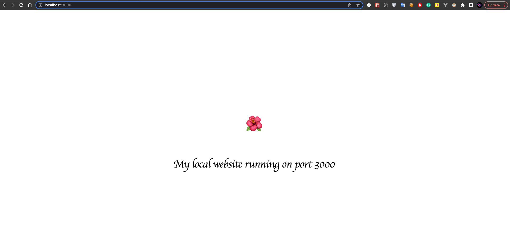

[Gehub](https://github.com/phamtrongngh/gehub) is a tool that helps expose the HTTP server running on your local machine. Its feature is the same as Ngrok or Localtunnel but easier to use (no need to install, access [Web UI](https://www.gehub.benalpha.online), and use).

# Usage
Try a demo version hosted at [Gehub](https://www.gehub.benalpha.online).
- Say there is a web server running on a port (example: 3000) in your local machine, and you want to expose it to the internet.

    >  **⚠️ IMPORTANT ⚠️**  
    > Make sure you have enabled [CORS](https://en.wikipedia.org/wiki/Cross-origin_resource_sharing) for the local server.
- Access [Gehub](https://www.gehub.benalpha.online), enter the port on which the local server running, then enter the alias (which will be generated randomly if not to be provided), and click Expose button.

- [Gehub](https://github.com/phamtrongngh/gehub) gives you an URL that links to your local server.

